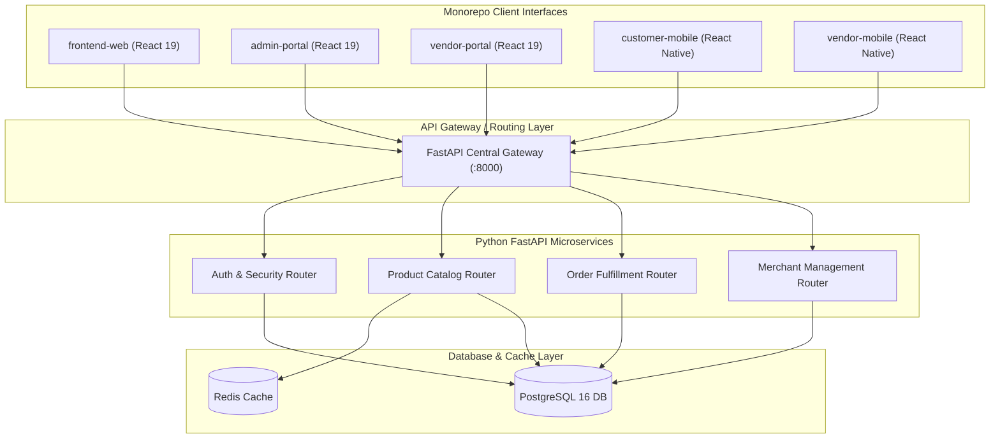

# SmartShop Enterprise System Architecture 🏗️

High-level architectural blueprint for the **SmartShop Enterprise** multi-vendor platform monorepo.

```text
Enterprise-SmartShop/
├── frontend-web/             Customer eCommerce Website (React 19 + Vite + Tailwind + Redux + TanStack Query)
├── admin-portal/             Super Admin Management Console (React 19 + Tailwind CSS)
├── vendor-portal/            Merchant Store Management Hub (React 19 + Tailwind CSS)
├── customer-mobile/          Customer Mobile Application (React Native CLI 0.74)
├── vendor-mobile/            Merchant Mobile App (React Native CLI 0.74)
├── backend-api/              High-Performance Microservices API (Python FastAPI + SQLAlchemy + Redis + Postgres)
└── docs/                     Architecture Diagrams, API Specifications & Database Schemas
```

## System Topology & Microservices Blueprint


