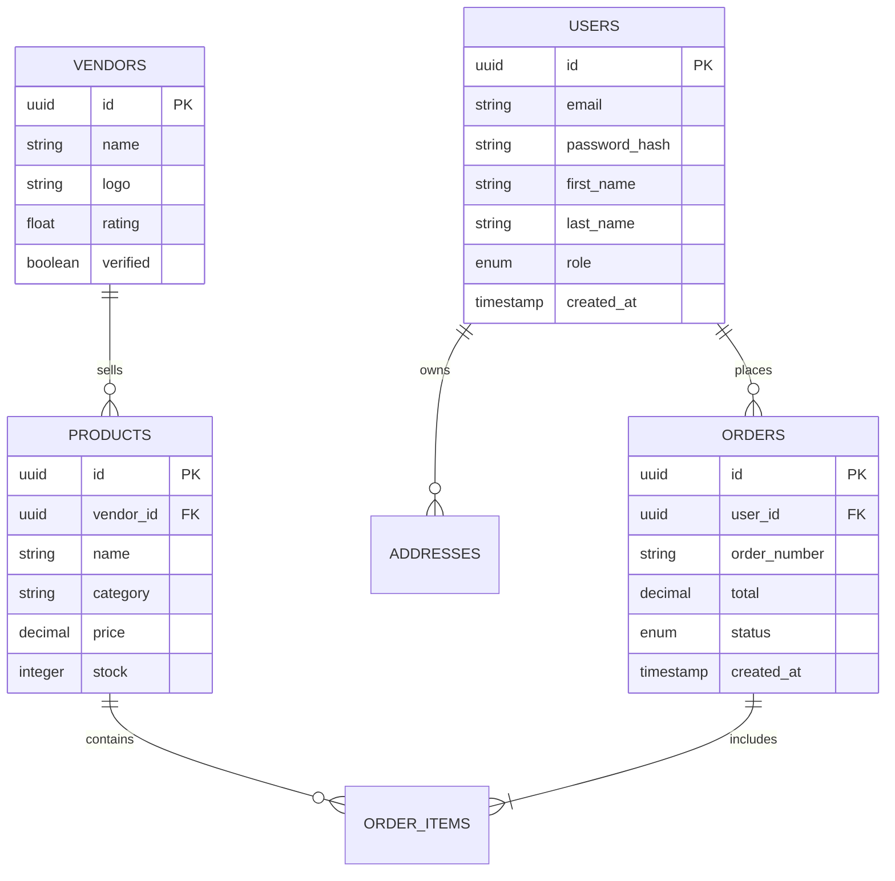

# Enterprise PostgreSQL Database ERD Schema

```mermaid
erDiagram
    USERS ||--o{ ORDERS : places
    USERS ||--o{ ADDRESSES : owns
    VENDORS ||--o{ PRODUCTS : sells
    PRODUCTS ||--o{ ORDER_ITEMS : contains
    ORDERS ||--|{ ORDER_ITEMS : includes

    USERS {
        uuid id PK
        string email
        string password_hash
        string first_name
        string last_name
        enum role
        timestamp created_at
    }

    VENDORS {
        uuid id PK
        string name
        string logo
        float rating
        boolean verified
    }

    PRODUCTS {
        uuid id PK
        uuid vendor_id FK
        string name
        string category
        decimal price
        integer stock
    }

    ORDERS {
        uuid id PK
        uuid user_id FK
        string order_number
        decimal total
        enum status
        timestamp created_at
    }
```
